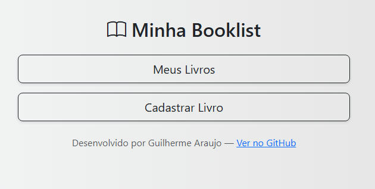
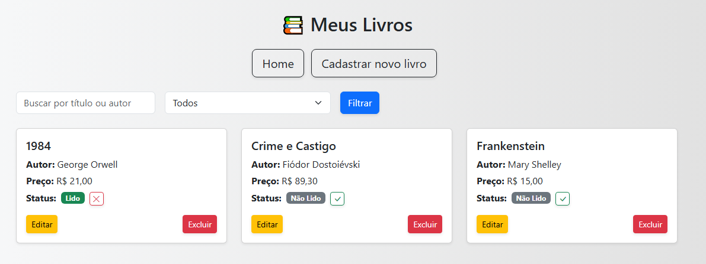
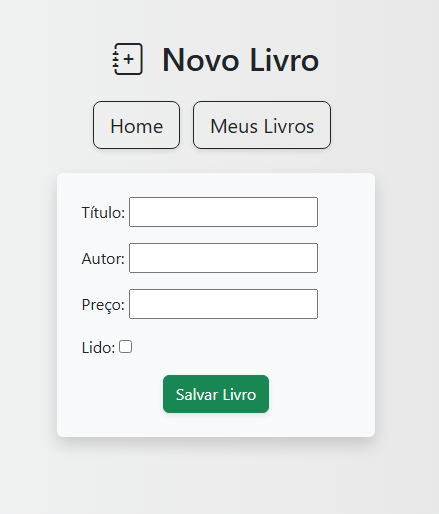

# 📚 Booklist

Um projeto Django para organizar seus livros lidos e não lidos. Com interface responsiva, filtros por status, e operações de cadastro, edição e exclusão com confirmação.

## 🖼️ Screenshots

### 🏠 Página Inicial


### 📋 Meus Livros



### 📝 Cadastro de Livro



## 🔧 Tecnologias usadas

- Python 3.x  
- Django 4.x  
- HTML + CSS  
- Bootstrap 5  
- SQLite  
- JavaScript (para modal de exclusão)


## ✨ Funcionalidades

- 📚 **Cadastro de Livros** — Adicione novos livros à sua lista pessoal.
- ✏️ **Edição de Livros** — Modifique os detalhes de livros existentes com facilidade.
- 🗑️ **Exclusão com Confirmação** — Remova livros com segurança, evitando exclusões acidentais.
- ✅ **Marcar como Lido/Não Lido** — Atualize o status de leitura diretamente nos cards.
- 🔍 **Filtros de Busca** — Filtre a lista por título, autor ou status de leitura.


## 📋 Pré-requisitos

Antes de começar, certifique-se de que você tem as seguintes ferramentas instaladas na sua máquina:

- 🧰 [Git](https://git-scm.com/downloads) — para clonar o repositório
- 🐍 [Python 3.x](https://www.python.org/downloads/) — para rodar o projeto (recomenda-se Python 3.10 ou superior)

💡 Você pode verificar se o Python e o Git estão instalados rodando `python --version` e `git --version` no terminal.


## 🚀 Como rodar o projeto localmente

### 1. Clone o repositório e navegue até o diretório do projeto

```bash
git clone https://github.com/Araujoo1/booklist.git
cd booklist
```

### 2. Crie um ambiente virtual

```bash
python -m venv venv 
```

### 3. Ative o ambiente virtual

No Windows:
```bash
venv\Scripts\activate
```

No Linux/macOS:
```bash
source venv/bin/activate
```

### 4. Instalar as dependências
```bash
pip install -r requirements.txt
```

### 5. Aplicar as migrações
```bash
python manage.py makemigrations
python manage.py migrate
```

### 6. Rodar o servidor
```bash
python manage.py runserver
```

### 7. Abrir o projeto na web
Agora é só ir em seu navegador e acessar http://127.0.0.1:8000/ 


## 👤 Autor

- **Guilherme Araujo** — [@Araujoo1](https://github.com/Araujoo1)